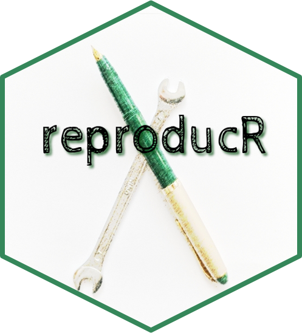
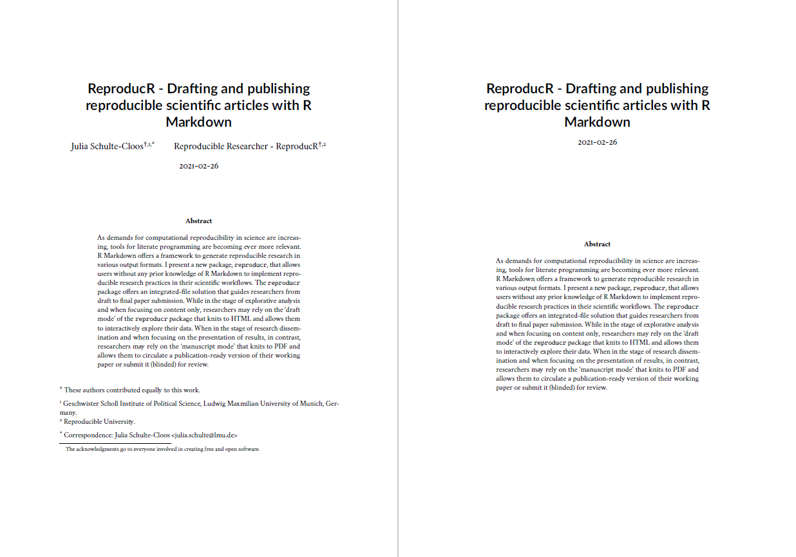

<!-- README.md is generated from README.Rmd. Please edit that file -->

```{r, include = FALSE}

library(icon)

knitr::opts_chunk$set(
  collapse = TRUE,
  comment = "#>",
  fig.path = "man/figures"
)
```


# reproducR <a href='https://pkg.jschultecloos.com/reproducr'> </a>


The `reproducr` package allows users without any prior knowledge of R Markdown to implement reproducible research practices in their scientific workflows. The `reproducr` package offers an integrated-file solution that guides researchers from draft to final paper submission. 

:star: In the stage of **explorative analysis** and when **focusing on content** only, researchers may rely on the **'draft mode'** of the template that knits to HTML and allows them to interactively explore their data and include interactive research output. 

:star: In the stage of **research dissemination** and when focusing on the **presentation of results**, in contrast, researchers may rely on the **'manuscript mode'** that knits to PDF and allows them to circulate a publication-ready version of their working paper or submit it (blinded) for review. 


## Installation


```{r echo=TRUE, eval=FALSE}
# Get the development version from GitHub:

# install.packages("devtools")

devtools::install_github("jschultecloos/reproducr")

```


## Usage 

To start working with `reproducr`, simply change the `output_format` parameter in your YAML header to specify the two output formats of `reproducr`:

1) `reproducr::reproducr_manuscript`
2) `reproducr::reproducr_draft`


```yaml
---
output: 
  reproducr::reproducr_manuscript: 
    blinded: false
  reproducr::reproducr_draft
---
```

- You can compile your document to a manuscript (PDF) by calling `rmarkdown::render("reproducr-file.Rmd", "reproducr::reproducr_manuscript")`

- You can compile your document to a draft (HTML) by calling `rmarkdown::render("reproducr-file.Rmd", "reproducr::reproducr_draft")`. 

You can also click on the 'Knit' button in the RStudio IDE or in PyCharm (with the R Markdown Plugin installed). In this case R Markdown will compile your document to the *first* output format that you specify in the `YAML` header. 


:bulb: If you prefer to start working with `reproducr` by relying on a template, you can load the package template from within your RStudio IDE by navigating to: `File > New File > RMarkdown.. > From Template > reproducr`. 


:bulb: Read [more about how to use `reproducr`](https://jschultecloos.github.io/reproducr/).


## Optimisation for scientific writing

**The `reproducr` package comes with extended functionality for scholarly writing. It helps you to...**

:sparkles: integrate **scholarly information** about authors, their (multiple) affiliations, their contributions, and the corresponding author in the title page of your manuscript

:sparkles: **blind your manuscript** before submitting it for review

```{r out.width="70%", fig.align="center", echo=FALSE}

```

:sparkles: include two **separate bibliographies** for the main article and the appendix 

:sparkles: generate documents that contain a date stamp in their file name while keeping a clean `.Rmd` for tracking changes with version control 

:sparkles: harmonise the fonts in your graphs with the fonts used in the respective output format 

:sparkles: create high-resolution graphs 

:sparkles: include your code with code-folding for HTML output and hide all of your code in PDF output

## Flexible output formats

The`reproducr` package offers you full flexibility to knit your document to a polished and well-formatted HTML that includes all your explorative analysis and dynamic research output. This feature is particularly useful while drafting a research paper or when writing up blog posts to communicate your results to a wider audience. At the same time, the `reproducr` package allows you to knit your document to a polished and submission-ready PDF manuscript which is optimised for scholarly use and can optionally be blinded for review. 

When writing your paper and your code, simply wrap the parts of the paper that are exclusive to one output format in three colons `::: {.not-in-format .latex}` closed by three more colons `:::`. The respective part of the document wrapped in the `not-in-format` `div` structure will not be included in LaTeX output. 

You can also make the **code evaluation** conditional on the output format by asking `knitr` to conditionally evaluate your code only when the output is HTML: `eval=knitr::is_html_output()`.

    
    ::: {.not-in-format .latex}
    
    This interactive `DT` table and this text will not be included in our document 
    when we knit to PDF manuscript mode with `reproducr::reproducr_manuscript`. 

    `r ''````{r interactive-table-datatable, eval=knitr::is_html_output()}
    pacman::p_load(DT, palmerpenguins)
    DT::datatable(penguins)
    ```
    :::
    
    
## Integration into the R Markdown framework 

`r icon::fa("long-arrow-alt-right")` The `reproducr` package does not simply offer [yet another](http://svmiller.com/blog/2020/09/another-rmarkdown-article-template/) [custom](https://github.com/juba/rmdformats) [`.Rmd` template](https://github.com/rstudio/rticles). 

`r icon::fa("long-arrow-alt-right")` The existing templates by `rmarkdown::pdf_document`, `bookdown::pdf_document2`, and `distill::distill_article` are extremely well-maintained. 

`r icon::fa("long-arrow-alt-right")` The `reproducr` package makes **minimal changes** to these existing templates. Instead, it advances the functionality of `bookdown::pdf_document2` and `distill::distill_article` by feeding [**Lua Filters** for Pandoc](https://github.com/pandoc/lua-filters) to the Pandoc command line just after R Markdown has evaluated the code and knitted the document based on the respective base format.   


### Citation:

Schulte-Cloos, Julia (2021). ReproducR: Drafting and publishing reproducible scientific articles with R Markdown. R package version 0.1.0, https://github.com/jschultecloos/reproducr. 


